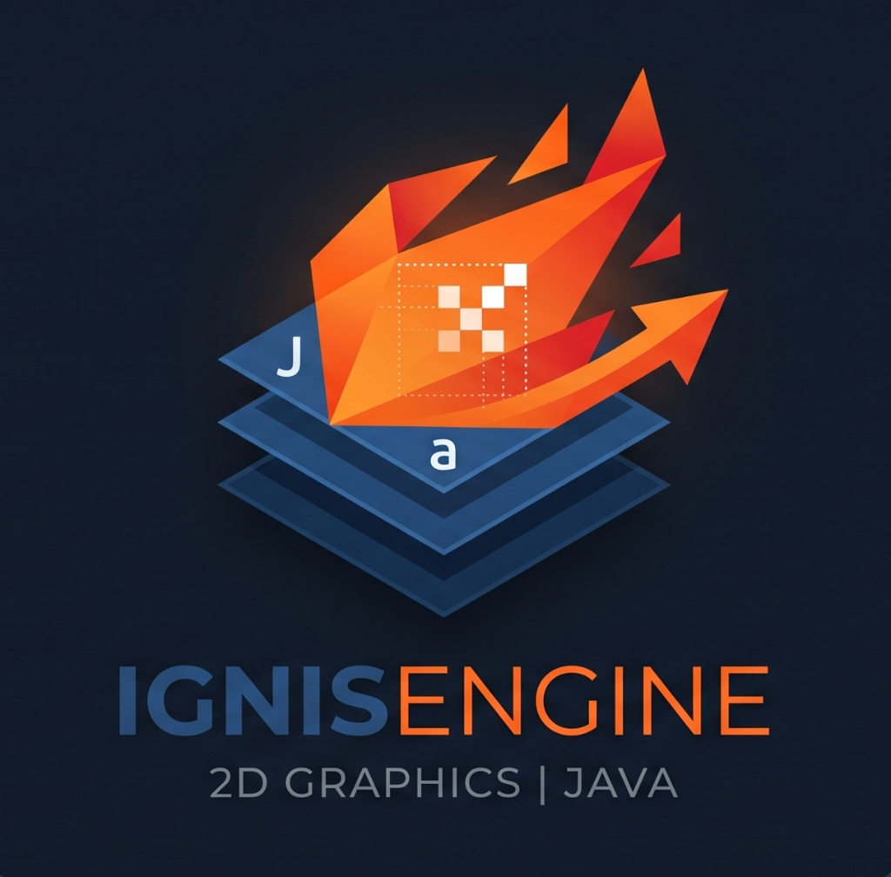

# IgnisEngine

<p align="center">
  
</p>

<p align="center">
  
  
  
  
</p>

IgnisEngine é uma engine gráfica 2D desenvolvida em Java puro, focada em renderização e na criação simplificada de jogos bidimensionais. O projeto é estruturado em componentes bem definidos que trabalham de forma coordenada para fornecer uma plataforma completa com um editor visual integrado.

---

## Estrutura do Projeto

```
IgnisEngine/
├── 📁 src/com/ignis/
│   ├── 📁 core/                 # Core da engine (loop principal e renderização)
│   │   ├── 📄 Game.java         # Loop do jogo, tick/render e canvas
│   │   └── 📄 GameObject.java   # Classe base para objetos de jogo
│   ├── 📁 editor/               # Editor visual integrado para modelagem de cenas
│   │   ├── 📄 Editor.java       # Interface gráfica e gerenciamento de painéis
│   │   └── 📄 settings.json     # Configurações salvas do layout do editor
│   └── 📁 main/                 # Ponto de entrada do jogo construído na engine
│       └── 📄 Main.java
├── 📁 doc/                      # Documentação técnica detalhada (Módulos do Vault)
├── 📁 .mvn/wrapper/             # Maven Wrapper para execução independente de versão
├── 📄 pom.xml                   # Configuração de dependências Maven
└── 📄 README.md                 # Este arquivo (Hub Central)
```

---

## Componentes

### Core — Motor Gráfico
O coração do IgnisEngine, responsável por toda a lógica de renderização e execução física/lógica:
* Loop de atualização e desenho constante (Tick/Render).
* Gerenciamento de tela com suporte a redimensionamento e modo tela cheia.
* Sistema de `GameObject` reutilizável para gerenciar elementos em cena.

### Editor — Ferramenta de Modelagem
Interface visual profissional para agilizar o desenvolvimento:
* **Hierarchy:** Árvore estrutural contendo todos os objetos presentes na cena.
* **Viewport:** Área de visualização em tempo real do estado de renderização.
* **Inspector:** Editor de propriedades e atributos dinâmicos do objeto selecionado.
* Salvamento automático do layout e restauração das preferências do desenvolvedor via JSON.

### Main — Execução do Jogo
A aplicação consumidora final que acopla o motor e o editor para a compilação e execução final do jogo desenvolvido.

---

## Hub de Documentação

Toda a documentação técnica detalhada do projeto está modularizada na pasta [doc/](doc/). Abaixo está o índice organizado de arquivos por área de interesse:

### Inteligência Artificial e Modo Agente (AI & AGENT Mode)
* **[Guia de Início Rápido do Agente](doc/AGENT_MODE_QUICKSTART.md)**: Manual rápido de 3 passos para configurar e testar tarefas automatizadas com IA.
* **[Manual de Uso Completo](doc/AGENT_MODE_GUIDE.md)**: Guia profundo contendo exemplos práticos, operações suportadas e troubleshooting de API.
* **[Guia de Integração de IA](doc/AI_INTEGRATION_GUIDE.md)**: Configurações do modelo Google Gemini 2.5 Flash na engine.
* **[Arquitetura e Detalhes Técnicos](doc/AGENT_MODE_TECHNICAL.md)**: Estrutura do parser JSON, rate limiting, conexões e benchmarks de desempenho.
* **[Roteiro de Validação e Testes](doc/AGENT_MODE_TESTING.md)**: Casos de teste estruturados para validar o comportamento da IA.
* **[Índice de Documentação do Agente](doc/AGENT_MODE_INDEX.md)**: Sumário de relações e fluxos de leitura recomendados por perfil de usuário.
* **[Histórico de Alterações do Modo Agente](doc/AGENT_MODE_CHANGES.md)**: Resumo das melhorias estruturais implementadas.
* **[Registro de Correções do Agente](doc/AGENT_MODE_FIXES.md)**: Correções de parser e chamadas de API.
* **[Guia de Testes de IA](doc/AI_TEST_GUIDE.md)**: Procedimentos para ensaios e medições do assistente.
* **[Melhorias de Prompts de IA](doc/AGENT_PROMPT_IMPROVEMENT.md)**: Engenharia de prompts usada para guiar o assistente de forma precisa.
* **[Status Final de Implementação](doc/AGENT_MODE_STATUS.md)**: Diagnóstico final de funcionalidade e prontidão do agente.

### Programação e Scripts (IgnisScript)
* **[Guia Completo do IgnisScript](doc/IGNIS_SCRIPTS.md)**: Manual definitivo para criação de comportamento e scripts em formato Ignis.
* **[Referência da API de Scripts](doc/IGNIS_SCRIPT_API.md)**: Lista completa das chamadas de API, classes de física, entrada e controle de objetos.
* **[Manual de Consulta Rápida](doc/IGNISSCRIPT_QUICK_REFERENCE.md)**: Resumo sintático rápido das funções e loops.
* **[Manual de Prefabs e Comportamentos](doc/PREFAB_SCRIPTS_GUIDE.md)**: Criação de templates de objetos de jogo com scripts associados.
* **[Especificação de Arquivo Ignis](doc/IGNIS_FILE_SPEC.md)**: Estrutura de sintaxe de arquivo e parseamento nativo.
* **[Documentação do Scripting para Agentes](doc/AGENT_IGNISSCRIPT_DOCUMENTATION.md)**: Guia fornecido para orientar IAs a programarem scripts.
* **[Correção do Script do Jogador](doc/PLAYER_SCRIPT_FIX.md)**: Correção de bugs de movimentação do jogador.

### Sistemas Físicos e Renderização (Colisão e Câmera)
* **[Sistema de Colisões Integrado](doc/IGNIS_COLLISION_SYSTEM.md)**: Lógica do mecanismo AABB/Círculo no espaço bidimensional.
* **[Guia de Física e Colisões](doc/COLLISION_AND_ALERTS_GUIDE.md)**: Regras de restrição física, trigger de áudio e física de movimento.
* **[Integração do Sistema de Colisão](doc/COLLISION_SYSTEM_INTEGRATION.md)**: Como acoplar os listeners físicos ao motor gráfico principal.
* **[Exemplos de Scripts de Colisão](doc/EXAMPLE_COLLISION_SCRIPTS.md)**: Código de referência comentado para lógica de danos, ricochete e limites de tela.
* **[Referência Rápida de Colisão](doc/IGNIS_COLLISION_QUICKREF.md)**: Resumo de funções úteis de colisão.
* **[Sistema de Controle de Câmera](doc/CAMERA_SYSTEM_DOCS.md)**: Movimento de zoom, foco no jogador e limites de viewport da câmera 2D.

### Sistema de Alertas (Alert System)
* **[Arquitetura de Alertas Visuais](doc/ALERT_SYSTEM_IMPLEMENTATION.md)**: Sistema de notificações temporizadas do painel flutuante do Viewport.
* **[Guia de Início Rápido de Alertas](doc/ALERT_QUICK_START.md)**: Configurações rápidas para testar alertas simples.
* **[Manual de Referência de Alertas](doc/ALERT_QUICK_REFERENCE.md)**: Tabela de métodos e constantes do componente de alerta.
* **[Validação e Testes de Alertas](doc/TESTING_ALERTS.md)**: Roteiros de testes visuais e temporizações das filas de alerta.

### Históricos e Resumos Globais
* **[Sumário de Implementações](doc/CHANGES_IMPLEMENTATION_SUMMARY.md)**: Lista completa das alterações físicas feitas no core e no editor.
* **[Sumário Geral de Mudanças](doc/CHANGES_SUMMARY.md)**: Registro histórico das evoluções estruturais globais.

---

## Requisitos do Sistema

| Tecnologia | Versão Mínima | Observação |
|---|---|---|
| **Java** | 11+ | Compatível com JDK 11 ou superior |
| **Maven** | 3.6.0+ | Ou utilize o Maven Wrapper incluso (`mvnw`) |

---

## Como Começar (Quick Start)

### Compilação com Maven

Utilize os comandos a seguir no terminal para compilar e empacotar o projeto:

```bash
# Compilar o código do projeto
./mvnw clean compile

# Executar testes
./mvnw test

# Empacotar para arquivo JAR executável
./mvnw package

# Limpar e instalar no repositório local
./mvnw clean install
```

### Executando em uma IDE

1. Clone o repositório:
   ```bash
   git clone https://github.com/URSoftware/IgnisEngine.git
   ```
2. Abra a pasta do projeto em sua IDE Java de preferência (VS Code, IntelliJ IDEA ou Eclipse).
3. **Para iniciar o Editor Visual (Recomendado):** Execute a classe `src.com.ignis.editor.Editor`.
   - O editor abrirá configurado por padrão.
   - Divisórias de painéis ajustadas dinamicamente pelo mouse serão persistidas automaticamente ao sair.
4. **Para iniciar apenas o Core de teste:** Execute a classe `src.com.ignis.core.Game`.
5. **Para iniciar o jogo final:** Execute a classe `src.com.ignis.main.Main`.

### Configuração do Editor Visual

As configurações do layout do editor são salvas no arquivo `src/com/ignis/editor/settings.json`:

```json
{
  "mainSplitDividerLocation": 250,
  "rightSplitDividerLocation": 1229
}
```

---

## Autores

<table>
  <tr>
    <td align="center">
      <a href="https://github.com/ThyagoToledo">
        
        <br />
        <sub><b>Thyago Toledo</b></sub>
      </a>
    </td>
    <td align="center">
      <a href="https://github.com/FeronZerbana">
        
        <br />
        <sub><b>FeronZerbana</b></sub>
      </a>
    </td>
    <td align="center">
      <a href="https://github.com/URSoftware">
        
        <br />
        <sub><b>URSoftware</b></sub>
      </a>
    </td>
  </tr>
</table>

---

Este projeto é desenvolvido e distribuído pela organização **URSoftware**. Para mais informações, consulte os termos de licença de uso incluídos no repositório.
